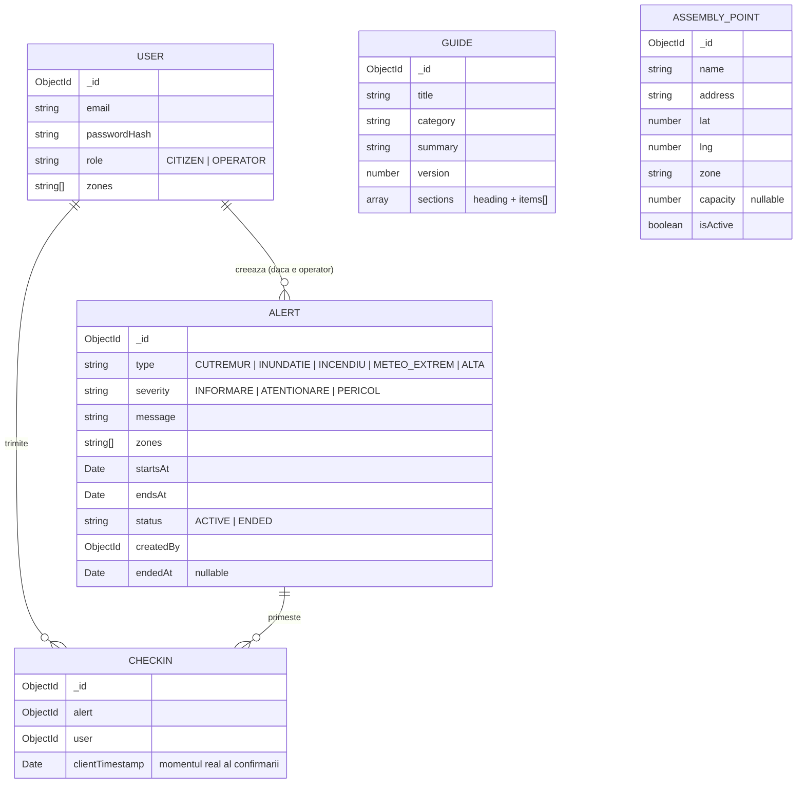

# Alertă Națională — Backend

API REST în NestJS + MongoDB, folosit de aplicația iOS (cetățean) și de dashboard-ul web (operator). Acest README acoperă și arhitectura de ansamblu a sistemului (valabilă pentru toate cele 3 componente) și schema bazei de date.

## Cuprins
- [Instrucțiuni de rulare](#instrucțiuni-de-rulare)
- [Populare bază de date (seed) și conturi de test](#populare-bază-de-date-seed-și-conturi-de-test)
- [Arhitectura sistemului](#arhitectura-sistemului)
- [Schema bazei de date](#schema-bazei-de-date)
- [Justificarea alegerilor tehnice](#justificarea-alegerilor-tehnice)
- [Funcționalități bonus](#funcționalități-bonus-peste-cerințele-minime)
- [Ce nu am terminat și ce aș fi făcut diferit](#ce-nu-am-terminat-și-ce-aș-fi-făcut-diferit)

---

## Instrucțiuni de rulare

### Cerințe
- Node.js 18+ (necesar pentru `fetch` nativ, folosit la integrările meteo)
- Un cluster MongoDB (Atlas sau local)

### Pași
```bash
git clone <repo-url> alerta-nationala-backend
cd alerta-nationala-backend
npm install
```

Creezi un fișier `.env` la rădăcină, după modelul `.env.example`:
```
ATLAS_URI=mongodb+srv://<user>:<parola>@<cluster>/
ATLAS_DB_NAME=alerta-nationala-proiect
JWT_ACCESS_SECRET=<secret-lung-si-aleator>
JWT_REFRESH_SECRET=<alt-secret-lung-si-aleator>
```
> Numele exacte ale variabilelor JWT sunt cele din `.env.example` din repo — completează-le cu valori proprii, nu le refolosi pe cele din exemplu.

Rulezi serverul:
```bash
npm run start:dev
```
API-ul pornește implicit pe `http://localhost:3000`.

### Populare bază de date (seed) și conturi de test
```bash
npm run seed:guides
```
Populează colecția de ghiduri de urgență (cutremur, incendiu, inundație, fenomene meteo extreme, reguli generale).

**Conturi pre-create pentru evaluare:**
- Cetățean: `citizen@test.com` / `Test1234!` (zonă: Cluj)
- Operator: `operator@test.com` / `Test1234!`

> Nu există endpoint de "promovare" la rolul de operator — e o decizie asumată (vezi secțiunea de mai jos). Contul de operator de test trebuie creat prin `POST /auth/register`, apoi rolul schimbat manual în MongoDB: `db.users.updateOne({email: "operator@test.com"}, {$set: {role: "OPERATOR"}})`.

Pentru testare completă, adaugă și câteva puncte de adunare din contul de operator (`POST /assembly-points`), în același județ cu contul de cetățean, ca să apară pe hartă.

---

## Arhitectura sistemului

```
┌─────────────────┐         ┌──────────────────┐
│   iOS (SwiftUI)  │         │  Web (React/Vite) │
│   cetățean       │         │  operator          │
└────────┬─────────┘         └─────────┬─────────┘
         │ JWT (access + refresh)      │ JWT
         └──────────────┬──────────────┘
                         │
                ┌────────▼─────────┐
                │  NestJS API       │
                │  (acest repo)     │
                └────────┬──────────┘
                         │
              ┌──────────┼──────────────────────┐
              │          │                       │
       ┌──────▼─────┐ ┌──▼──────────┐  ┌────────▼────────┐
       │  MongoDB    │ │ Open-Meteo  │  │ MeteoAlarm (ANM) │
       │  (Atlas)    │ │ (prognoză)  │  │ (avertizări      │
       └─────────────┘ └─────────────┘  │  meteo oficiale) │
                                          └──────────────────┘
```

**Module NestJS:**
- `AuthModule` — înregistrare, login, refresh token (JWT access + refresh), parole hash-uite.
- `UsersModule` — profil, zone de interes (`PATCH /user/zones`).
- `AlertsModule` — CRUD alerte, check-in, statistici de confirmare.
- `GuidesModule` — ghiduri de urgență, cu versionare pentru sincronizare incrementală.
- `AssemblyPointsModule` — CRUD puncte de adunare (creare/editare/dezactivare, nu ștergere).
- `WeatherModule` — prognoză (Open-Meteo) + avertizări meteo oficiale (MeteoAlarm/ANM).

**Autorizare pe roluri:** `RolesGuard` + decoratorul `@Roles(...)`, aplicat peste `JwtAuthGuard` pe fiecare endpoint care trebuie restricționat la `OPERATOR`. Rolul e citit din payload-ul JWT (`req.user.role`), populat de `JwtStrategy`.

**Fluxul de date pe zone:** utilizatorul își alege una sau mai multe zone (județe, listă statică ASCII, ex. `"Cluj"`, `"Timis"`) la înregistrare, editabile ulterior. Alertele, avertizările meteo și punctele de adunare sunt filtrate server-side după intersecția cu `user.zones` — operatorul vede tot, necenzurat de nicio zonă.

---

## Schema bazei de date



Indecși relevanți: `Alert(zones, status)`, `AssemblyPoint(zone, isActive)`, `CheckIn(alert, user)` unic (un singur check-in per user per alertă — upsert la re-trimitere).

---

## Justificarea alegerilor tehnice

- **Zone ca stringuri simple, fără diacritice** (`"Cluj"`, `"Constanta"`), nu ID-uri sau coduri: listă statică de 42 de intrări, ținută identică (hardcodată) în toate cele 3 codebase-uri. Am ales asta în locul unui endpoint `/zones` ca să nu introducem încă o dependență de rețea pentru o listă care nu se schimbă niciodată.
- **Open-Meteo pentru prognoză** — gratuit, fără API key, suficient de precis pentru scopul aplicației. **MeteoAlarm/ANM pentru avertizări oficiale** — sursă reală, oficială, gratuită, feed CAP/Atom public, fără cheie. Le-am ținut separate intenționat: prognoza nu e o avertizare oficială, iar cerința 3.6 zice explicit că trebuie diferențiate vizual.
- **Fără cont de "promovare" la operator** — pentru scopul unui proiect de facultate, un endpoint de auto-promovare la rol de operator ar fi o gaură de securitate reală (oricine s-ar putea auto-promova). Am preferat promovare manuală în DB pentru contul de test, documentată clar aici.
- **Check-in cu upsert** (`findOneAndUpdate` cu `upsert: true`) în loc de `insert` simplu — reflectă corect cerința ca userul să poată re-trimite check-in-ul dintr-o coadă offline fără să genereze duplicate.

---

## Funcționalități bonus (peste cerințele minime)

- Avertizări meteo **oficiale**, agregate din feed-ul public MeteoAlarm (sursă: ANM), nu doar o euristică derivată din codul de prognoză.
- Alertele sunt și ele cache-uite local pe iOS (nu doar ghidurile și punctele de adunare, cum cerea minimul), cu indicator explicit de "date posibil neactualizate" când sunt offline.
- Deep link către Google Maps / Apple Maps pentru rute către punctele de adunare.
- Protecție la nivel de client împotriva check-in-urilor duplicate (`CheckedInAlertsStore`), pe lângă upsert-ul de pe server.

---

## Ce nu am terminat și ce aș fi făcut diferit

- **Promovarea la rol de operator** e manuală (direct în DB). Aș fi făcut un endpoint de administrare protejat separat (ex. cu o cheie de admin în `.env`), nu doar editare manuală.
- **Sincronizarea alertelor offline** se reîmprospătează doar la redeschiderea ecranului Home, nu printr-un listener continuu de rețea (`NWPathMonitor` pe iOS). Ar actualiza automat imediat ce revine conexiunea, chiar dacă userul rămâne pe ecran.
- **Fără notificări push** — userul află de o alertă nouă doar când deschide aplicația. Într-un sistem real de tip RO-Alert, notificarea push (sau chiar cell broadcast) e esențială; am renunțat la ea din lipsă de timp și pentru că necesită infrastructură suplimentară (APNs).
- **Fără teste automate** (unit/integration) — dat fiind timpul limitat, am prioritizat acoperirea funcțională completă a cerințelor față de testare automată.
- **Securitate de producție minimă** — nu am adăugat `helmet`, rate limiting pe endpoint-uri sensibile (`/auth/login`) sau CORS restrictiv; sunt potrivite pentru evaluare, nu pentru producție reală.
- **Matching-ul de zone pentru avertizările MeteoAlarm** se face prin normalizare de diacritice pe numele de județ din feed; dacă ANM și-ar schimba vreodată formatul denumirilor, maparea s-ar rupe silențios (fără eroare, doar avertizarea n-ar mai apărea) — aș fi adăugat un test de sanitate care verifică periodic că toate cele 42 de județe din feed se mapează cu succes.
