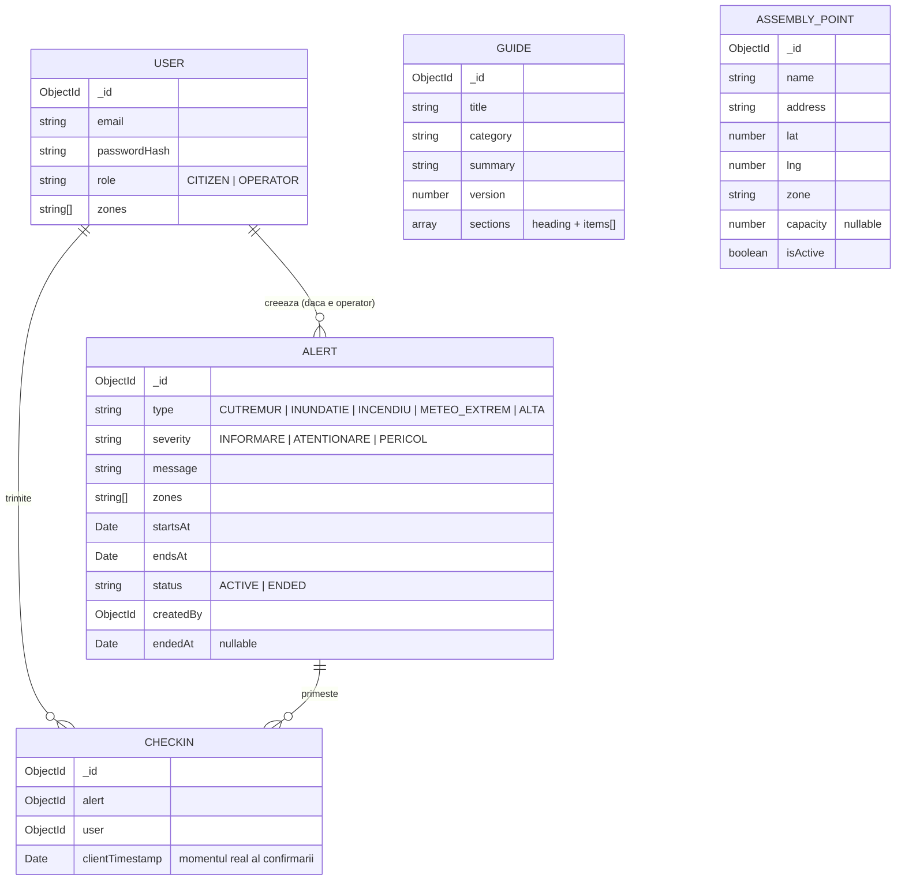

# Alerta Nationala - Backend

API REST in NestJS + MongoDB, folosit de aplicatia iOS (cetatean) si de dashboard-ul web (operator). Acest README acopera si arhitectura de ansamblu a sistemului (valabila pentru toate cele 3 componente) si schema bazei de date.

---

## Instructiuni de rulare

### Cerinte
- Node.js 18+ (necesar pentru `fetch` nativ, folosit la integrarile meteo)
- Un cluster MongoDB (Atlas)

### Pasi

Rulezi serverul:
```bash
npm run start:dev
```
API-ul porneste implicit pe `http://localhost:3000`.
Backend-ul deployed se regaseste la adresa: https://alerta-nationala-backend.vercel.app/.

### Populare baza de date (seed)
```bash
npm run seed:guides
```
Populeaza colectia de ghiduri de urgenta (cutremur, incendiu, inundatie, fenomene meteo extreme, reguli generale).
In baza de date din Atlas, aceste ghiduri sunt deja populate.

**Conturi pre-create pentru evaluare:**
- Cetatean: `alexia.aldea@mready.net` / `123456`
- Operator: `alexia.elena.aldea@gmail.com` / `123456`

---

## Arhitectura sistemului

```
┌─────────────────┐         ┌──────────────────┐
│   iOS (SwiftUI)  │         │  Web (React/Vite) │
│   cetatean       │         │  operator          │
└────────┬─────────┘         └─────────┬─────────┘
         │ JWT (access + refresh)      │ JWT
         └──────────────┬──────────────┘
                         │
                ┌────────▼─────────┐
                │  NestJS API       │
                │  (acest repo)     │
                └────────┬──────────┘
                         │
              ┌──────────┼──────────────────────┐
              │          │                       │
       ┌──────▼─────┐ ┌──▼──────────┐  ┌────────▼────────┐
       │  MongoDB    │ │ Open-Meteo  │  │ MeteoAlarm (ANM) │
       │  (Atlas)    │ │ (prognoza)  │  │ (avertizari      │
       └─────────────┘ └─────────────┘  │  meteo oficiale) │
                                          └──────────────────┘
```

**Module NestJS:**
- `AuthModule` - inregistrare, login, refresh token (JWT access + refresh), parole hash-uite.
- `UsersModule` - profil, zone de interes (`PATCH /user/zones`).
- `AlertsModule` - CRUD alerte, check-in, statistici de confirmare.
- `GuidesModule` - ghiduri de urgenta, cu versionare pentru sincronizare incrementala.
- `AssemblyPointsModule` - CRUD puncte de adunare (creare/editare/dezactivare, nu stergere).
- `WeatherModule` - prognoza (Open-Meteo) + avertizari meteo oficiale (MeteoAlarm/ANM).

**Autorizare pe roluri:** `RolesGuard` + decoratorul `@Roles(...)`, aplicat peste `JwtAuthGuard` pe fiecare endpoint care trebuie restrictionat la `OPERATOR`. Rolul e citit din payload-ul JWT (`req.user.role`), populat de `JwtStrategy`.

**Fluxul de date pe zone:** utilizatorul isi alege una sau mai multe zone (judete, lista statica, ex. `"Cluj"`, `"Timis"`) la inregistrare, editabile ulterior. Alertele, avertizarile meteo si punctele de adunare sunt filtrate server-side dupa intersectia cu `user.zones` - operatorul vede tot, necenzurat de nicio zona.

---

## Schema bazei de date



Indecsi relevanti: `Alert(zones, status)`, `AssemblyPoint(zone, isActive)`, `CheckIn(alert, user)` unic (un singur check-in per user per alerta - upsert la re-trimitere).

---

## Justificarea alegerilor tehnice

- **Zone ca stringuri simple, fara diacritice** (`"Cluj"`, `"Constanta"`), nu ID-uri sau coduri: lista statica de 42 de intrari, tinuta identica (hardcodata) in toate cele 3 codebase-uri. Am ales asta in locul unui endpoint `/zones` ca sa nu introducem inca o dependenta de retea pentru o lista care nu se schimba niciodata.
- **Open-Meteo pentru prognoza** - gratuit, fara API key.
- **MeteoAlarm/ANM pentru avertizari oficiale** - sursa reala, oficiala, gratuita. Le-am tinut separate intentionat: prognoza nu e o avertizare oficiala.
- **Check-in cu upsert** (`findOneAndUpdate` cu `upsert: true`) in loc de `insert` simplu - reflecta corect cerinta ca userul sa poata re-trimite check-in-ul dintr-o coada offline fara sa genereze duplicate.

---

## Ce as fi facut diferit

- **Promovarea la rol de operator** e manuala (direct in DB). As fi facut un endpoint de administrare protejat separat (ex. cu o cheie de admin in `.env`), nu doar editare manuala sau posibilitatea de creare cont de operator din platforma Admin.
